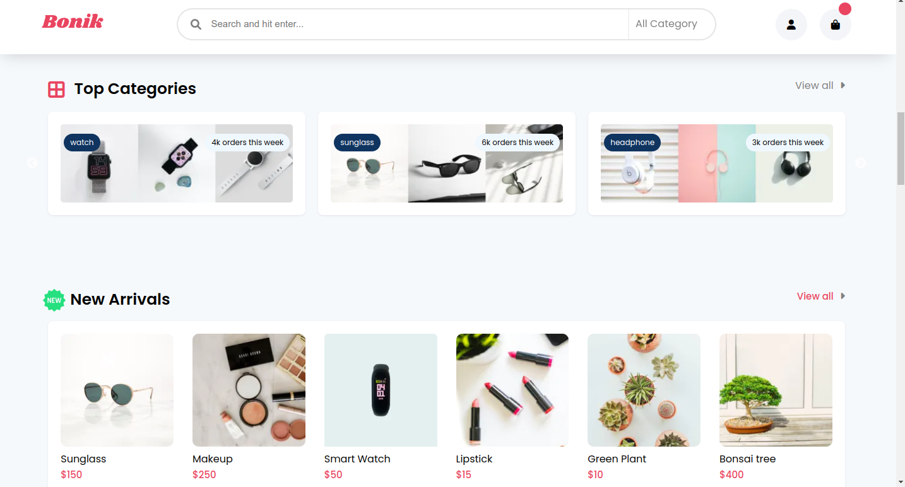

# 🛒 Bonic E-commerce Website

This is a modern, responsive, and interactive e-commerce website built using **React**. It offers a range of features that allow users to browse products, add items to the cart, and complete purchases securely. The site is optimized for a smooth and engaging user experience on both desktop and mobile devices.

## ✨ Features

- **Browse Products**: Explore a wide variety of products across multiple categories.
- **Add to Cart**: Add products to the shopping cart with quantity selection.
- **Cart Management**: Update or remove items from the cart.
- **Secure Checkout**: Complete purchases with a smooth and secure multi-step checkout process.
- **Responsive Design**: Optimized for all screen sizes, from mobile to desktop.


## 🛠 Technologies Used

-  **React**: JavaScript library for building user interfaces and managing application state.
-  **HTML**: For the basic structure of the website.
-  **CSS**: For styling and making the site visually appealing and responsive.
-  **JavaScript**: For implementing interactivity and handling logic.


## ⚙️ How It Works

1. **Browse Products**: Users can browse featured or categorized products on the homepage.
2. **Add to Cart**: Add desired products to the shopping cart with a click.
3. **View Cart**: Open the cart to review selected items, adjust quantities, or remove products.
4. **Checkout**: Proceed to the checkout process, where users can provide shipping information and complete their purchase.
5. **User Authentication**: Users can log in or register to manage their orders, and save personal details for future purchases.

## 📸 Screenshots





## 📦 Installation

### To run the project locally, follow these steps:

1. **Clone the repository:**
   ```bash
   https://github.com/Rukshan1999/bonic-e-commerce-frontend.git

2. **Navigate to the project directory:**
    ```bash
    cd bonic-ecommerce

3. **Install dependencies:**
    ```bash
    npm install

4. **Run the development server:**
    ```bash
    npm start

5. **Open the app in your browser:**
    Navigate to http://localhost:3000 to view the app.

## 🚀 Usage

- Start the app locally using the development server or deploy it using Firebase or another hosting platform.
- Browse products, add items to the cart, and proceed to checkout to complete a purchase.
You can register and log in to track your orders and manage your account.

## 🎨 Customization

- Product Data: Update the product information by editing the data/products.js file.
- Styling: You can customize the site's appearance by modifying the style.css or React components' inline styles.
- Functionality: Add or modify features by editing the components inside the src folder.

## 📝 Version
1.0.0

## License
This project is licensed under the MIT License. See the LICENSE file for more details.

## 📧 Contact
Tharindu Rukshan :
tharindurukshan709@gmail.com